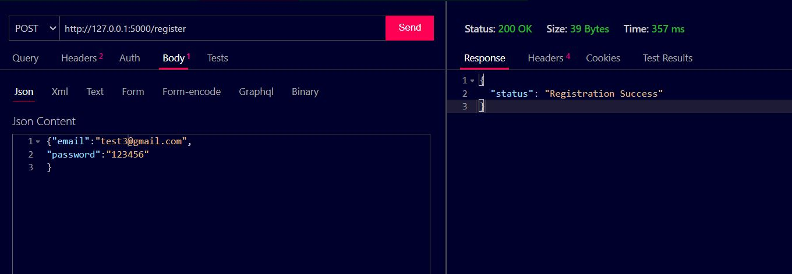
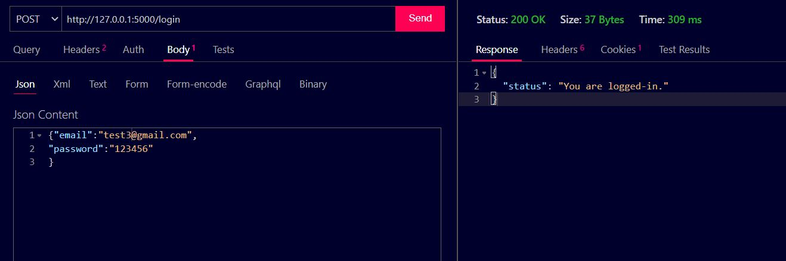
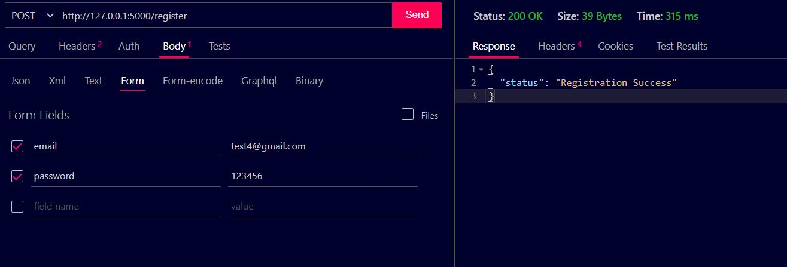
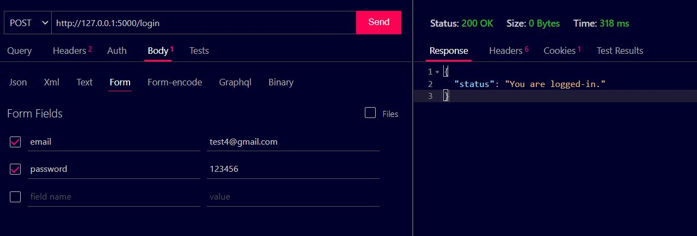
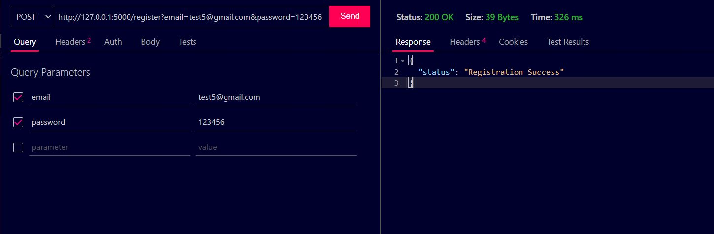
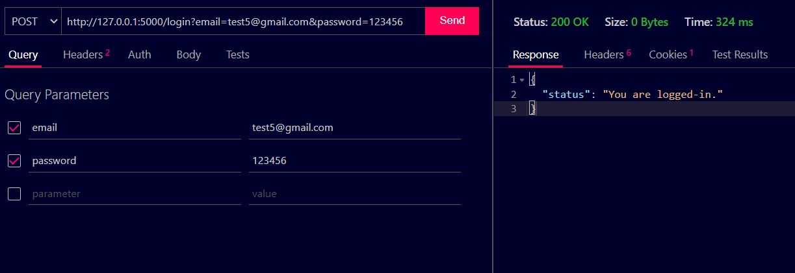

<h1><b>Task-API <?b></h1>

APIs for login and register built with <b>Flask</b>, in which password are encrypted with the 
help of Bcrypt and after that store in Database (MongoDB).

<h2><b>Some demo images of API</b> </h2>

<ul>
    <li> 
    Data sent by JSON:-  
    Register
    
    </li>
    <li> 
    Data sent by JSON:-  
    Login
    
    </li>
    <li> 
    Data sent by FORM:-  
    Register
    
    </li>
    <li> 
    Data sent by FORM:-  
    Login
    
    </li>
    <li> 
    Data sent by Parameter:-  
    Register
    
    </li>
    <li> 
    Data sent by Parameter:-  
    Login
    
    </li>
    <li> 
    User Not Found 
    
    </li>
    <li> 
    User already exists 
    
    </li>
    <li> 
    Password mismatched 
    
    </li>
</ul>

